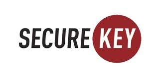

# **Case Study Proposal: SecureKey**
---

 

## What Is It
---

SecureKey Technologies was founded in 2010 by [Greg Wolfond](https://securekey.com/about-securekey/meet-team/) who has more than 30 years of experience in FinTech, mobile solutions and security. Also, he is a well-known entrepreneur who is widely known as the founder/CEO of 724 solutions and Footprint Software Inc which he later sold to IBM. [SecureKey Technologies](https://101blockchains.com/companies/securekey-technologies/) breaks down the barrier between diversity and technology by providing simple access to consumers for online application and services. As one of the leading authentication and identity provider; consumers are able to access their personal documents and IDs from smartphones or contactless cards safely. SecureKey can be widely used for digital payments, digital identity, various types of authentication, personal credentials and many more. Lastly, the [corporation](https://securekey.com/about-securekey/#mhmm-16813) has partnered with leading financial institutes such as BMO, CIBC, Scotiabank along with organisations such as the Digital ID Authentication Council of Canada and secured investments to enhance the digital identification ecosystem. Currently, they provide two services; "verified.Me" and "Government sign-in by Verified.Me".

## Why This Matters
---

In current digital era, the use of internet has immensely increased with everything being easily accessible. However, there has been increase in frustration with growing list of passwords and login as well as growing security and privacy breaches, identity thefts and many more. According to the current [industry data](https://financialpost.com/news/fp-street/securekey-a-toronto-startup-with-big-name-backers-aims-to-slay-internet-security-dragon#:~:text=SecureKey%20was%20founded%20by%20Greg,earth%20in%20the%20dotcom%20crash.), an average individual has 25 passwords to handle. Moreover, [research predictions](https://www.itworldcanada.com/article/more-2021-cybersecurity-predictions-every-service-without-mfa-will-suffer-a-breach/439430) for 2021 includes:

 * Internet of things devices such as smart TVs, baby monitors, house security systems will impose greater risk in houses and businesses.
 
 * Public sector and government ogranisations including schools and universities will face more threaths of ransomware which are capable of shutting down the whole system.
 
 * Corporate networks that are trying to support increased number of remote employees are vulnerable to security breaches as they are rushed to go remote and fail to implement basic security safeguards as well as poorly configured cloud infrastructure.

 * Increased number of organisation's implementing and accepting technologies that help their security teams increase their efficiency and decrease burnouts. 

According to the Mike Lloy, CTO of ReadSeal, the gamechanger in security industry is to take away something rather than adding additional widget. Likewise, the CEO of SecureKey excepts an increased use of digital ID in almost every industry from purchasing a house to checking healtcare details securely as the following would become a priortity in todays' day and age. Moreover, this current trend is predicted to grow in the near future; where digital ID ecosystem like Verified.Me will be essential globally.

## Why This May be Interesting
---
SecureKey is one of the most significant blockchain based project carried out in Canada with some of the largest financial institutes and organisations contributing in bringing the idea to life. Their blockchain based software protects the privacy of their consumers in an ever-increasing cyber threats era. SecureKey makes it easier for their users to transfer personal or sensitive data to trusted networks along with full access to banking facilities exclusively provided by all the participating banks. One of the main advantages of the software is that users get the flexibility of consenting to the amount of personal information that they want to share with particular instituition based on the services that they are using. The following tackles the ongoing problem of oversharing and reduces the risk of data breaches.
   
   * **Verified.ME** uses a IBM blockchain platform which includes HyperLedger by the Linux Foundations, hence, allows users to share their personal information while quickly and securely verifying their identity online. This is highly regarded and a necessity in the banking industry which has been prone to increased cyber attacks, costing around *18.3 million annaully* per company.
   
   * The app is easy to use and understand for the users. Also, it is a cost-effective solution for companies in providing more personalised client services and onboarding.
   
   * SecureKey Blockchain System makes services and products readily available to users through Verified.Me authentication. This speeds up the operations which takes a lot of time in processing
   
   * The platform does not keep any kind of personal information such as emails, addresses and passwords nor do they share private credentials which garauntees 100% consumer safety.

## Things to Keep in Mind for a Case Study
---

* the importance of blockchain in making Verified.Me successful.

* The 2021 prediction on the rising threat on cyber security faced by businesses and individuals 

* The increasing use and dependency on the internet.

* The global impact that SecureKey Technologies can possibly make when the trend continues as predicted.

## Resources
---

* [About SecureKey](https://securekey.com/about-securekey/#mhmm-16813)

* [Meet the Team](https://securekey.com/about-securekey/meet-team/)

* [More 2021 cybersecurity predictions: ‘Every service without MFA will suffer a breach’](https://www.itworldcanada.com/article/more-2021-cybersecurity-predictions-every-service-without-mfa-will-suffer-a-breach/439430)

* [SecureKey Technologies](https://101blockchains.com/companies/securekey-technologies/)

* [SecureKey, a Toronto startup with big-name backers, aims to slay Internet security dragon](https://financialpost.com/news/fp-street/securekey-a-toronto-startup-with-big-name-backers-aims-to-slay-internet-security-dragon#:~:text=SecureKey%20was%20founded%20by%20Greg,earth%20in%20the%20dotcom%20crash.)

* [Why Canadian banks are choosing the SecureKey blockchain system](https://coinrivet.com/canadian-banks-choosing-securekey-blockchain-system/#:~:text=The%20SecureKey%20blockchain%20system%20is,services%20faster%20without%20privacy%20risks.)

